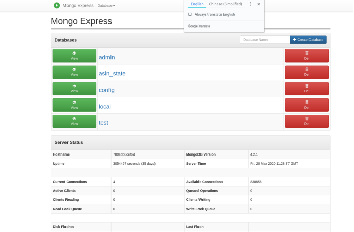

Chinese：mongo-express未授权访问漏洞
mongo-express是MongoDB可视化图形界面
攻击者可对目标数据库任意增删改查

English：Mongo express unauthorized access vulnerability            Mongo express is a mongodb visual graphic interface    
Attacker can add, delete, modify and check the target database arbitrarily

以下是部分案例，据本人初步统计，网上超7层以上都可直接为授权访问。
The following are some cases. According to my preliminary statistics, more than 7 levels of online access can be directly authorized.
Fofa.so Sentence：title=mongo-express
这里提供10个案列：
Here are 10 cases：
http://47.105.178.82:8082/
http://122.112.186.67:8087/
http://47.94.12.104:8081/
http://118.126.95.92:18081/
http://111.230.219.117:8080/
http://47.104.243.215:9000/
http://47.103.28.36:8081/
http://106.54.92.189:8082/
http://106.13.183.29:8081/
http://120.77.255.171:7071/
http://47.100.28.22:8081/
http://116.62.106.215:8081/
http://140.116.24.83:8081/
http://221.192.138.66:9000/
http://106.54.92.189:8082/
